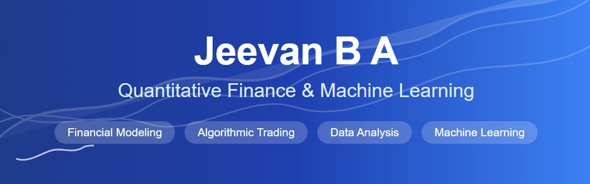
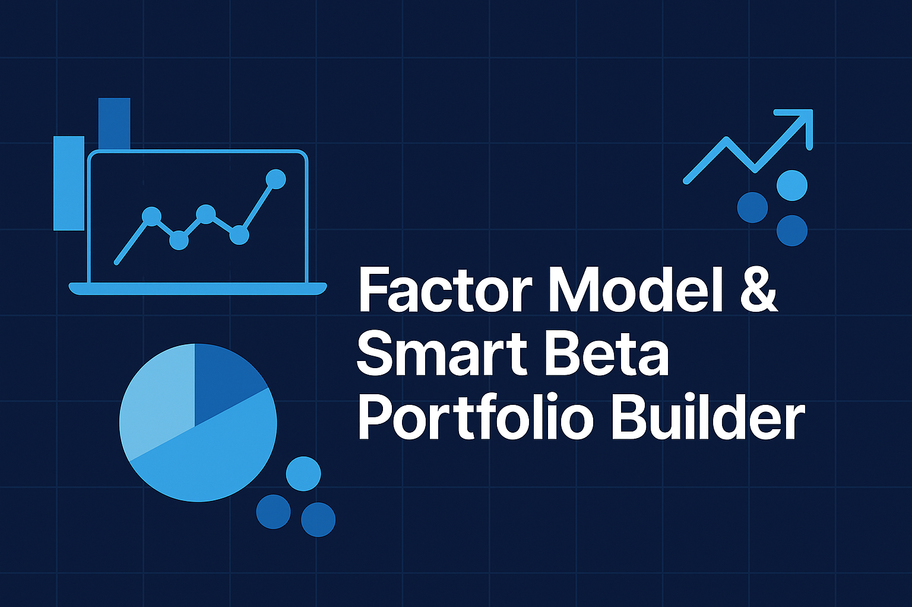
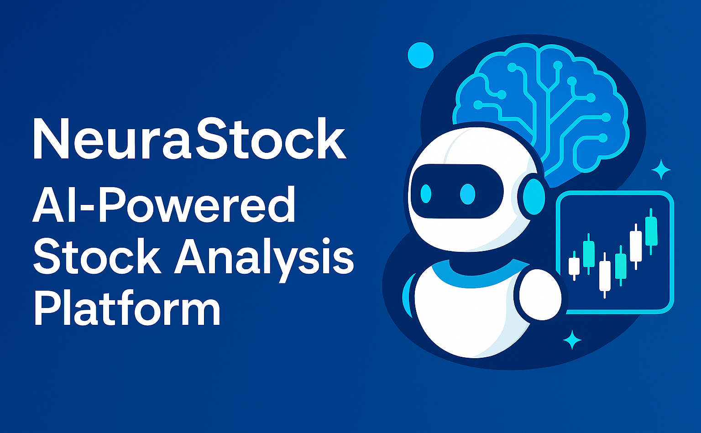
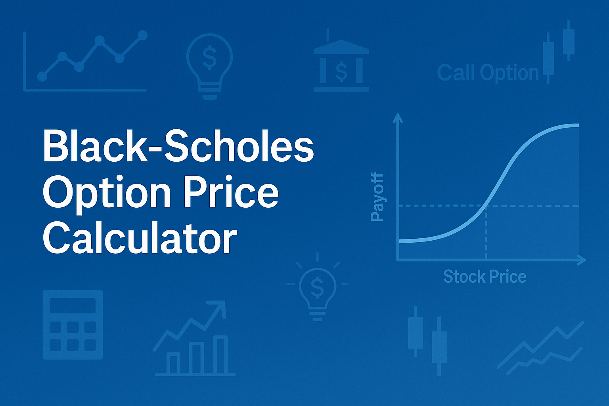

  

  

## 💫 About Me

- 🎓 Computer Science student at VIT, Vellore (Class of 2025)
- 💻 Passionate about Quantitative Finance, Algorithmic Trading, Machine Learning and Data Analysis
- 🌐 Founder of [Finance Fluent Blog](https://financefluentblog.com/)
- 🔍 Currently exploring AI and ML applications in financial markets
- 🌱 Learning advanced statistical models for risk assessment

  

## 🛠️ Arsenal of Skills & Technologies

  <!-- Core Programming Languages -->
  
  
  
  
  
  
  <!-- Python Packages & Frameworks -->
  
  
  
  
  
  
  
  
  <!-- Web, Database & Other Technologies -->
  
  
  
  
  
  
  
  

## 📊 GitHub Stats

  

  

  

## 🔥 Featured Projects

<table>
  <tr>
    <td width="50%">
      <h3 align="center">Factor Model & Smart Beta Portfolio Builder</h3>
      

        
        

          Advanced portfolio optimization tool utilizing factor models and smart beta strategies
        

      

    </td>
    <td width="50%">
      <h3 align="center">AI-Powered Stock Analysis</h3>
      

        
        

          AI-driven platform for advanced stock market analysis and prediction
        

      

    </td>
  </tr>
  <tr>
    <td width="50%">
      <h3 align="center">Black-Scholes Option Price Calculator</h3>
      

        
        

          Implementation of the Black-Scholes model for options pricing analysis
        

      

    </td>
    <td width="50%">
      <h3 align="center">Donchian Channel Breakout Strategy</h3>
      

        
        

          Trading system based on Donchian Channel breakout patterns
        

      

    </td>
  </tr>
</table>

## 📈 My Contributions

  

<!-- Snake animation -->

  

## 🌐 Connect With Me

  
  
  

<!-- Dynamic typing effect -->

  

